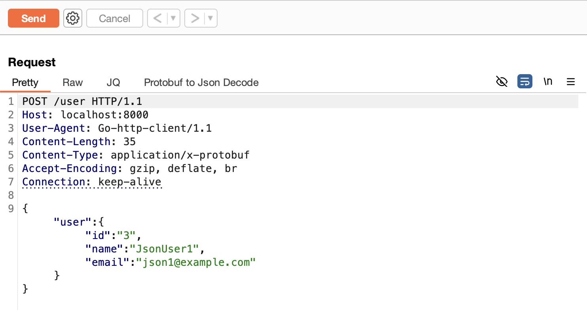
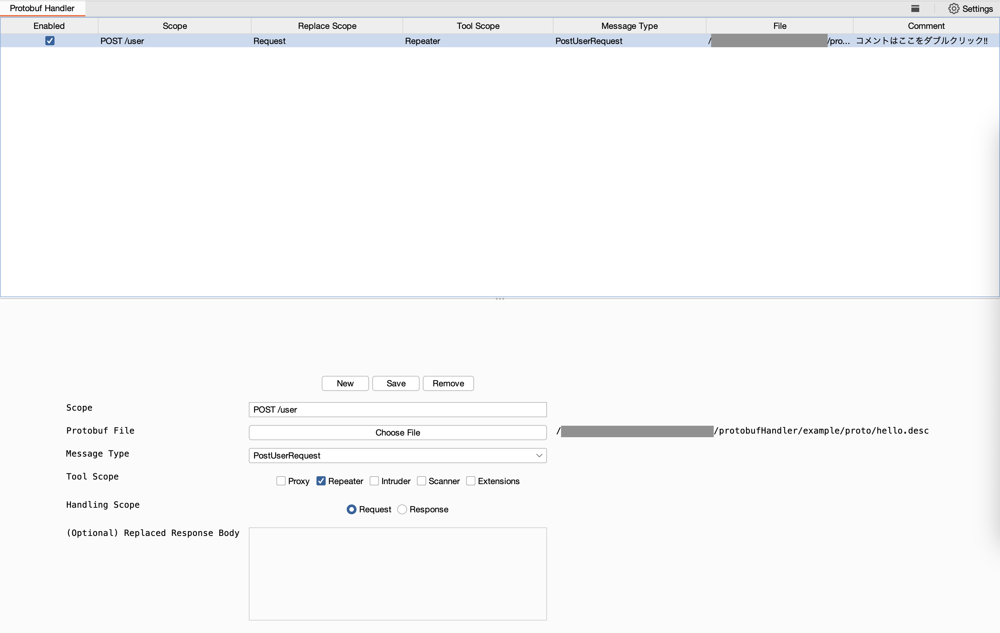
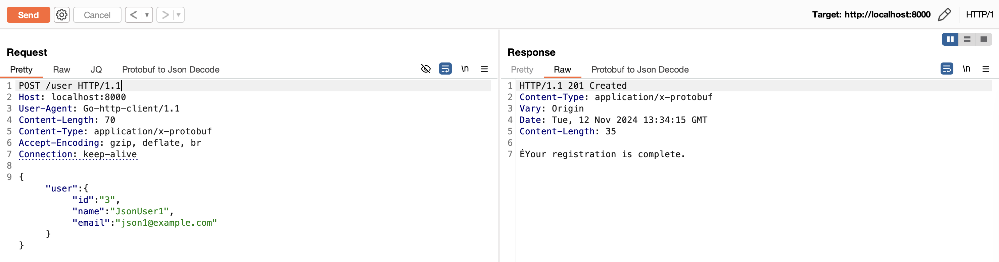
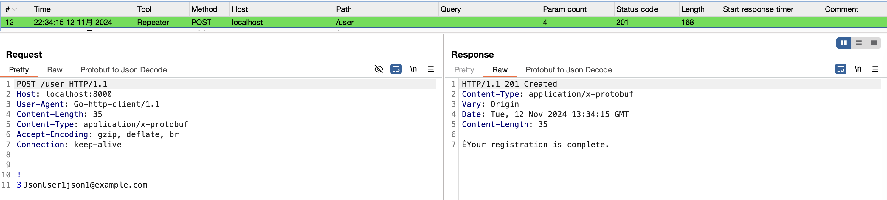
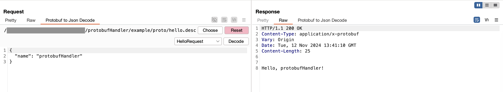
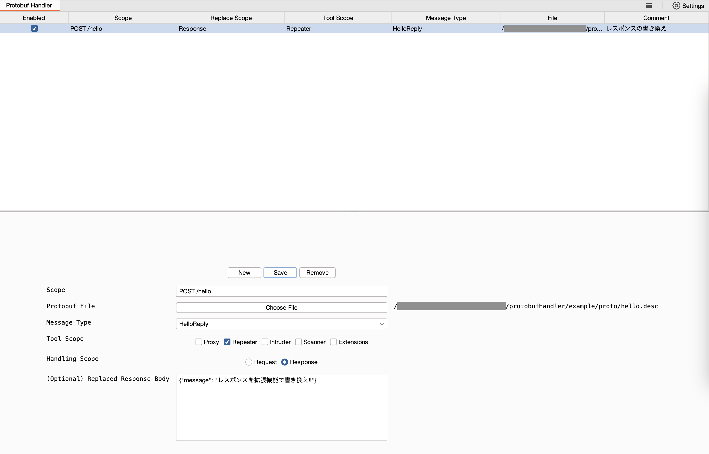
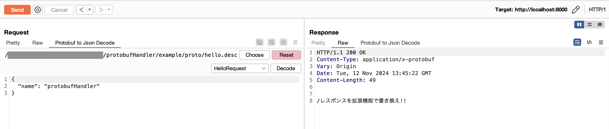
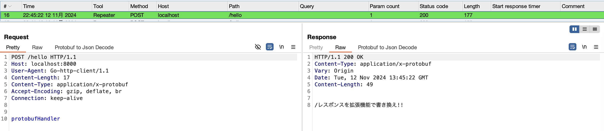

# Handler

Burp の Proxy、Repeater、Intruder、Scanner、Extensions を通過するリクエスト、レスポンスに対して Json から Protobuf メッセージへの変換を行います。  
また、リクエスト、レスポンス両方の変換に対応しています。

## 事前準備

1. [Protocol Buffer Compiler Installation](https://grpc.io/docs/protoc-installation/) を参考に適宜 `protoc` コマンドをインストールしてください。
1. 拡張機能で読み込むための `Descriptor` ファイルを作成します
```shell
# 例
$ cd protobufHandler/example/proto
$ protoc --descriptor_set_out=./hello.desc *.proto
$ ls
hello.desc  hello.proto user.proto
#  ↑これを作成する
```
> [!NOTE]
> 拡張子は必ず .desc としてください。

3. import ファイルが複数ある場合などは適宜 --proto_path オプションなどを追加してください。
```shell
#例
$ protoc --proto_path=./protobuf/:. --descriptor_set_out=./hello.desc *.proto
```

作成した `.desc` ファイルを使って Protobuf メッセージの変換を行います。

## Request handling

1. 対象のリクエストを Burp の Target Scope に登録します
1. 対象のリクエストの Body に Json を記述します

1. Protobuf Handler のタブを開き、「New」ボタンで新しいルールを追加します
1. 画面に表示される項目を入力します
    - Scope: 対象となるリクエストを指定 (正規表現は不可)
    - Protobuf File: descriptor_set_out で出力したファイルを選択
    - Message Type: Protobuf に変換する定義を指定
    - Tool Scope: どのツールから送信されたリクエストを対象とするか指定
    - Handling Scope: Request を選択
    - Comment: 任意。その時の気持ちなど (コメントセルをダブルクリックで編集できます)
1. 入力後、「Save」ボタンをクリックして保存します
1. テーブルの「Enable」にチェックを入れ準備は完了です

1. Repeater タブに戻り、Body が Json のリクエストを送信します

1. Logger を表示すると、Protobuf に変換されていることを確認できます


## Response handling

レスポンスのハンドリングではレスポンスボディを Protobuf メッセージに変換するだけでなく、`(Optional) Replaced Response Body` に Json を入力することで、事前に入力した Json に書き換え、それを Protobuf メッセージに変換できます。

1. レスポンスを書き換える対象のリクエストを Burp の Target Scope に登録します
1. 予め書き換え対象のリクエストの通常時のレスポンスを確認します

1. Protobuf Handler のタブを開き、「New」ボタンで新しいルールを追加します
1. 画面に表示される項目を入力します
    - Scope: 対象となるリクエストを指定 (このリクエストのレスポンスを書き換える)
    - Protobuf File: descriptor_set_out で出力したファイルを選択
    - Messsage Type: Protobuf に変換する定義を指定
    - Tool Scope: どのツールのレスポンスを対象とするか指定
    - Handling Scope: Response を選択
    - (Optional) Replaced Response Body: ボディの中身を固定にする場合に指定
    - Comment: 任意。気分 (コメントセルをダブルクリックで編集できます)
1. 入力後、「Save」ボタンをクリックして保存します
1. テーブルの「Enable」にチェックを入れ準備は完了です

1. Repeater タブに戻り、リクエストを送信します
1. レスポンスの中身が書き換わっていることを確認できます

1. また Logger でも書き換わっていることを確認できます


### 補足

ActiveScan++ など拡張機能から送信される Scan リクエストは「Extensions」で送信されます。そのため、Scan で使用する場合は、Tool Scope に 「Scan」「Extensions」の2つにチェックを入れることをおすすめします。