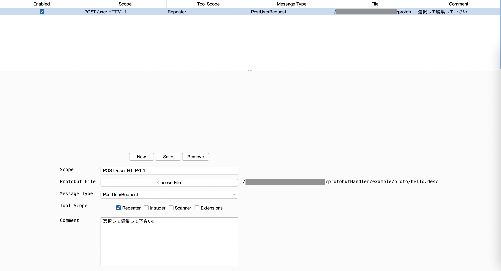
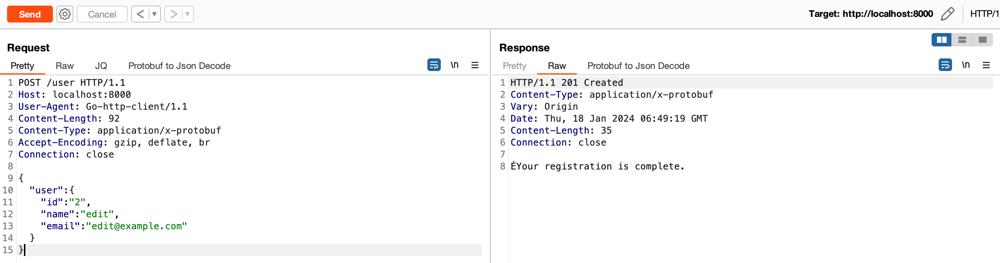
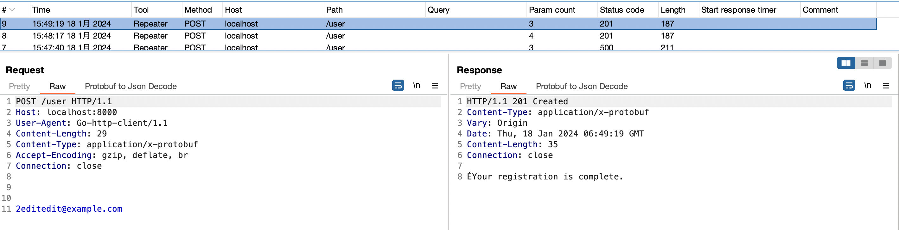

# Handler

Burp の Repeater、Intruder、Scanner、Extensions を通過するリクエストに対して、Json から Protobuf メッセージへの変換を行います。

## 手順

1. 対象のリクエストを Burp の Target Scope に登録します
1. 対象のリクエストを Repeater に送信し、Protobuf to Json Decode で Json に変換します
1. 出力された Json をコピーして、元のリクエストの Body に貼り付けます
1. Protobuf Handler のタブを開き、「New」ボタンで新しいルールを追加します
1. 画面に表示される項目を入力します
    - Scope: 対象となるリクエストを指定 (正規表現は不可)
    - Protobuf File: descriptor_set_out で出力したファイルを選択
    - Message Type: Protobuf に変換する定義を指定
    - Tool Scope: どのツールから送信されたリクエストを対象とするか指定
    - Comment: 任意
1. 入力後、「Save」ボタンをクリックして保存します
1. テーブルの「Enable」にチェックを入れ準備は完了です

1. Repeater タブに戻り、Body が Json のリクエストを送信します

1. Logger を表示すると、Protobuf に変換されていることを確認できます

### 補足

ActiveScan++ など拡張機能で追加した Scan リクエストは「Extension」で送信されます。そのため、Scan で使用する場合は、Tool Scope に 「Scan」「Extension」の2つにチェックを入れることをおすすめします。