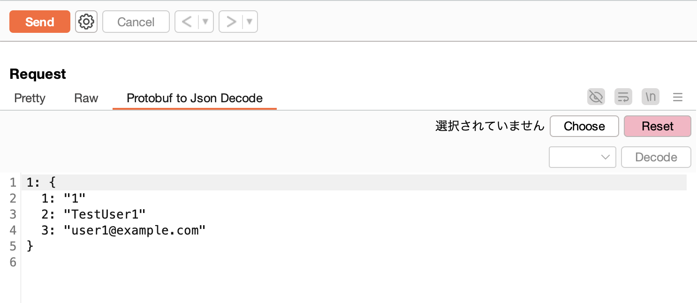
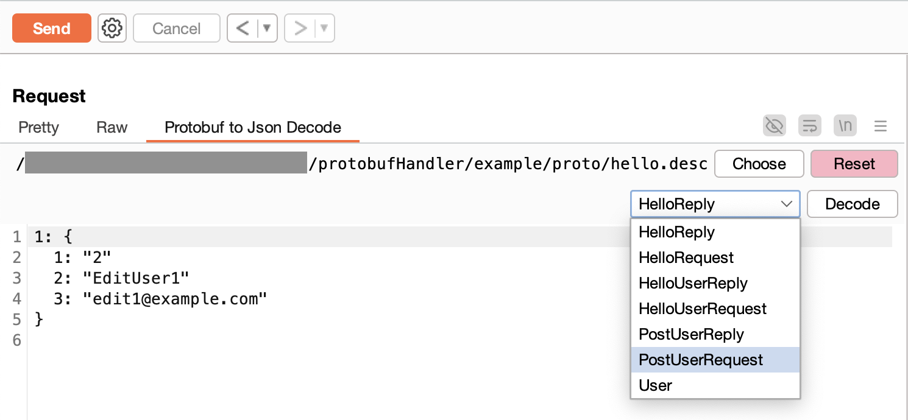
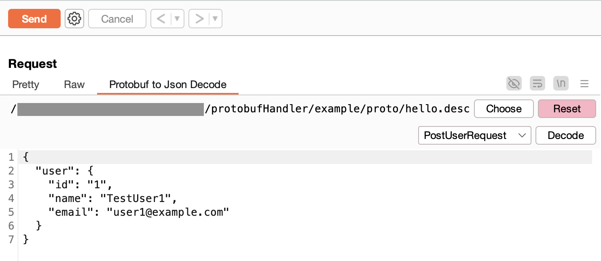
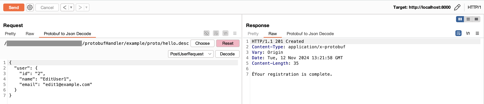
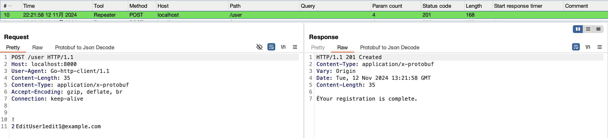

# Message Editor

Burp のメッセージエディターに Protobuf メッセージと Json を相互変換するタブを表示します。

## 事前準備

1. [Protocol Buffer Compiler Installation](https://grpc.io/docs/protoc-installation/) を参考に適宜 `protoc` コマンドをインストールしてください。
1. 拡張機能で読み込むための `Descriptor` ファイルを作成します
```shell
# 例
$ cd protobufHandler/example/proto
$ protoc --descriptor_set_out=./hello.desc *.proto
$ ls
hello.desc  hello.proto user.proto
#  ↑これを作成する
```
> [!NOTE]
> 拡張子は必ず .desc としてください。

3. import ファイルが複数ある場合などは適宜 --proto_path オプションなどを追加してください。
```shell
#例
$ protoc --proto_path=./protobuf/:. --descriptor_set_out=./hello.desc *.proto
```

作成した `.desc` ファイルを使って Protobuf メッセージの変換を行います。

## 手順

1. サポートしている `Content-Type` の時、「Protobuf to Json Decode」タブが表示されます
1. Protobuf to Json Decode タブを選択すると Raw フォーマットで表示されます

1. 「Choose」ボタンで descriptor_set_out で出力したファイルを選択します
1. 読み込みに成功すると Message Type が選択できるようになります

1. デコードしたい Message Type を選択し、「Decode」ボタンをクリックしてください


### Repeater での相互変換

1. Repeater タブに対象のリクエストを送信する
1. Protobuf to Json Decode タブから Json に変換する
1. 出力された Json を編集し「Send」をクリックする

1. Logger を表示すると、Protobuf に変換されていることを確認できます


### サポートしているContent-Type

```
application/x-protobuf
application/protobuf
application/grpc-web+proto
application/grpc
```

> [!TIP]
> Content-Type を追加したい場合は `AppEditorProvider.java:18` の `ENABLE_EDITOR_CONTENT_TYPE` に追加してビルドし直してください。