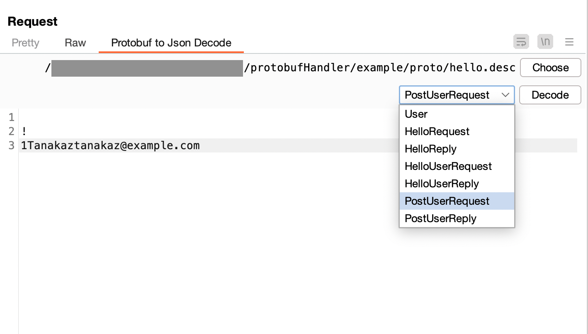
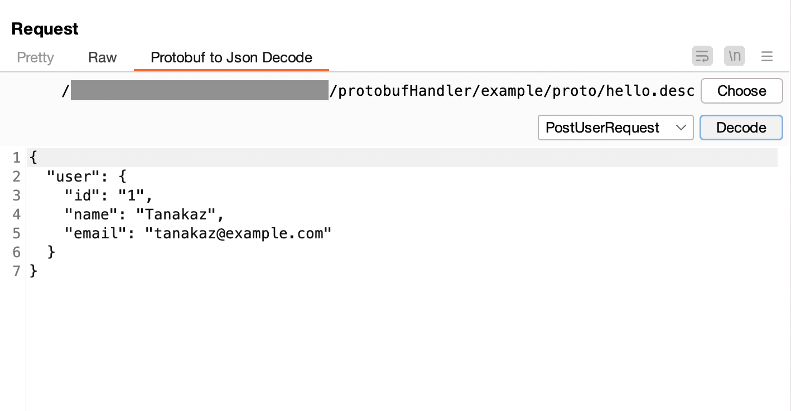

# Message Editor

Burp のメッセージエディターに Protobuf メッセージを Json に変換するタブを表示します。

## 手順

1. サポートされている `Content-Type` の時、「Protobuf to Json Decode」タブが表示されます
1. Protobuf to Json Decode タブを選択し、「Choose」ボタンで descriptor_set_out で出力したファイルを選択します
1. 読み込みに成功すると Message Type が選択できるようになります

1. デコードしたい Message Type を選択し、「Decode」ボタンをクリックしてください


### 補足

Decode 後に表示される Json は編集することが可能になっています。任意の値に編集後に「Raw」タブに戻ると Json から Protobuf メッセージに変換されます。  
また「Raw」タブに戻らず「Send」しても表示されている Json を Protobuf メッセージに変換して送信されます。

### サポートされているContent-Type

```
application/x-protobuf
application/protobuf
application/grpc-web+proto
```